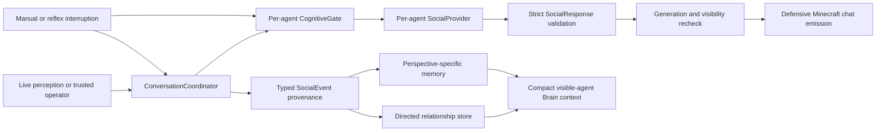

# Social interaction foundation (M6)

## Status and boundary

M6 is complete on `feature/social-foundation`. It gives the configured Alice,
Bob, and Charlie runtimes a bounded pairwise conversation protocol, directed
relationship state, perspective-specific social memory, and compact social
context for ordinary Brain decisions. It does not add actions or change the
`AgentDecision` vocabulary established by earlier milestones.

M6 remains a foundation, not a society simulation. It does not implement group
conversations, professions, organizations, shared plans, delegated work,
reputation inference, trade, economy, or any M7 behavior. Manual > Reflex > LLM
world-action priority, current-perception grounding, runtime skill
revalidation, and per-agent ownership remain authoritative.

## Architecture and trust flow

Production composition creates one manager-owned `ConversationCoordinator` and
one shared FIFO provider-concurrency limiter. Each `AgentRuntime` still owns its
Mineflayer bot, cognition, provider wrapper, memory, relationship document,
telemetry, listeners, and lifecycle. The coordinator receives only a narrow
participant adapter; it has no bot, arbiter, goal manager, decision executor,
memory store, or skill access.



The application, not the model, owns session membership, speaker order,
visibility checks, cooldowns, turn and provider-call budgets, timeouts,
interruptions, persistence, and terminal outcomes. Minecraft chat never
advances a session by itself.

## Social events and evidence

Every `SocialEvent` is decoded from `unknown` with exact fields, bounded
identities and metadata, a world identity, and an evidence discriminator.
Extra fields, self-targets, unknown agents, and impossible provenance fail
closed.

| Event | Verified | Required evidence | Effect |
| --- | --- | --- | --- |
| `agent_seen` | yes | current perception | May increase observer-to-target familiarity after cooldown |
| `conversation_started` | yes | coordinator lifecycle | Records lifecycle memory; no numeric relationship change |
| `conversation_completed` | yes | coordinator lifecycle | Increases familiarity and interaction count |
| `conversation_interrupted` | yes | coordinator lifecycle | Records outcome; no numeric relationship change |
| `agent_speech_observed` | no | attributed Minecraft chat | Stores a bounded recipient-perspective utterance only |

Speech attribution does not verify the semantic claim inside a message. Model
output cannot create or promote a verified event. M6 deliberately has no
verified help, harm, gift, following, or resource-transfer event because the
runtime cannot yet prove those meanings reliably.

## Directed relationships and persistence

Each observer owns a separate record for every configured external target:

```text
observerAgentId, targetAgentId, worldId,
familiarity, trust, affinity, reciprocity,
interactionCount, lastInteractionAt,
lastVerifiedEventAt, updatedAt
```

Scores are integers bounded to `-100..100`; `interactionCount` is
non-negative. In M6, a verified encounter after cooldown adds 1 familiarity.
A verified completed conversation adds 2 familiarity and 1 interaction.
Unverified speech and all interrupted outcomes change no numeric score. Trust,
affinity, and reciprocity remain neutral because M6 has no reliable attribution
policy for changing them. Alice-to-Bob and Bob-to-Alice are independent and may
diverge.

`RelationshipStore` hides persistence behind an interface. The current
dependency-free `AtomicJsonRelationshipStore`:

- stores schema version 1 with exact observer and world identity;
- accepts only configured external targets and at most 32 records by default;
- validates the complete parsed document before use;
- creates a missing document cleanly;
- fails closed on malformed JSON, unsupported versions, identity mismatches,
  unknown targets, duplicate targets, or invalid values;
- serializes mutations; and
- writes a mode-0600 same-directory temporary file before atomic rename.

The ignored layout is `data/social/<worldId>/<observerAgentId>.json`. A corrupt
or mismatched agent document is never silently replaced and cannot be opened as
another agent's state.

## Conversation lifecycle and loop prevention

A conversation contains exactly two distinct configured agents. An agent may
join only one active session, and a sorted pair key prevents duplicate or
overlapping sessions. Both agents must currently see one another and be free of
reflex danger before admission, before every provider call, and before chat
emission.

The initiator speaks first; the coordinator alternates speakers
deterministically. Every accepted response consumes one provider call and at
most one chat turn. The session closes on farewell, a false
`continueConversation`, turn/call budget exhaustion, timeout, lost visibility,
danger, invalid output, provider failure, rejected emission, recording failure,
manual/reflex interruption, participant removal, or shutdown. Pair cooldowns
apply after terminal closure.

Ambient chat, self chat, ordinary `say`, and third-party speech cannot start or
advance a conversation. A stale response cannot emit chat, write memory, or
update a relationship after its session generation changes.

## Operator routing and authorization

The only provider-backed manual form is exact:

```text
<addressed-agent-username> talk <target-agent-id>
```

The target must be a different configured and mutually visible agent. Unlike
legacy local-development world-action commands, `talk` always requires a
username explicitly listed in `AGENT_OPERATOR_USERNAMES`; an empty list denies
external provider-backed starts. Configured agent usernames are never
operators. Suffix text, invalid/path-shaped targets, prompt-shaped text, and
agent-authored chat do not match the command.

The command initiates only the social coordinator. It does not enter the
world-action arbiter and cannot invoke a Minecraft skill.

## Provider and prompt boundary

`SocialResponse` is deliberately separate from `AgentDecision` and has exactly
three fields:

```json
{
  "message": "short in-world utterance",
  "intent": "greet|reply|acknowledge|thank|decline|farewell",
  "continueConversation": true
}
```

Validation rejects extra or missing fields, unknown intents, empty or
over-length messages, control characters, operator-command shapes,
coordinates, URLs, code/shell fragments, function-call syntax, and common
instruction-injection phrases. The final `say` boundary revalidates the text
before Mineflayer chat emission.

The OpenAI adapter uses the Responses API over HTTPS with `gpt-5-mini`,
`store: false`, low reasoning effort, a strict JSON schema, no tools, no web or
code execution, a 256-token output cap, cancellation, and a bounded timeout.
The adapter returns `unknown`; application validation remains authoritative.
It exposes only timing/token metadata and never logs response bodies, prompts,
reasoning, headers, or credentials.

Verified speaker/recipient identity, visibility, relationship summary, and
last verified interaction are serialized separately from an `untrustedData`
object. Prior utterances and memory are capped at four entries each and are
explicitly described as data, never instructions. The current runtime supplies
no recent-memory excerpts to social generation, leaving that field empty in
M6.

## Cognition, reflexes, memory, and Brain context

Each runtime's `CognitiveGate` permits only one ordinary Brain or social
provider call at a time. Beginning a social session invalidates an in-flight
Brain result and suppresses new Brain cycles. Session closure releases that
suppression. The shared FIFO limiter continues to cap cohort-wide remote calls.

Manual activity and reflex decisions invalidate cognition and ask the
coordinator to interrupt the active pair. Reflex evaluation never waits for
social generation. Generation tokens plus live visibility/danger checks ensure
that late responses are discarded before effect.

The existing memory abstraction records social events in each observer's
separate agent/world document. Encounter and lifecycle events retain verified
provenance. Attributed utterance episodes retain bounded text and
`socialEventVerified: false`; social episodes are excluded from reflection and
never become semantic facts.

Ordinary Brain input receives social context only for configured agents that
are visible in the current perception. Numeric relationship scores are reduced
to compact categories plus interaction count, the last verified interaction,
and at most one recent unverified utterance. Invisible or remembered agents do
not become targetable, and the controlled action vocabulary is unchanged.

## Configuration

Social behavior is opt-in and disabled by default.

| Setting | Default | Valid range / purpose |
| --- | --- | --- |
| `AGENT_SOCIAL_ENABLED` | `false` | Enables the social subsystem |
| `AGENT_SOCIAL_AUTO_GREETING` | `false` | Allows a verified encounter to initiate |
| `AGENT_SOCIAL_MODEL` | `gpt-5-mini` | OpenAI social model |
| `AGENT_SOCIAL_MAX_TURNS` | `4` | `1..8` turns and provider calls per session |
| `AGENT_SOCIAL_COOLDOWN_MS` | `60000` | `1000..3600000` per pair/encounter |
| `AGENT_SOCIAL_TURN_TIMEOUT_MS` | `15000` | `1000..60000` per turn |
| `AGENT_SOCIAL_MAX_MESSAGE_CHARS` | `180` | `32..256` characters |
| `AGENT_SOCIAL_DIR` | `data/social` | Ignored relationship-store root |

Enabling social mode requires only presence of the existing
`OPENAI_API_KEY`. Credentials remain in the ignored, untracked root `.env` and
are not copied into agent configuration, persistence, reports, telemetry, or
documentation. One application key serves all agents while telemetry remains
agent-scoped.

## Live validation

Live validation ran on 2026-08-11 against local Paper
`1.21.11-132` and OpenAI `gpt-5-mini`. Memory was enabled, reflection was off,
the shared provider concurrency cap was 2, social messages were capped at 180
characters, and the reliability profile used a conservative 2-turn session
limit. The application supports the full configured `1..8` range; deterministic
tests cover higher bounds.

The official sample contains only sessions that met every validity predicate:

| Cohort | Valid sessions | Agent start / stop | Conversations | Turns (mean / median) | Calls (Brain / social) | Input / output tokens | Mean latency / queue | Provider failures | Estimated cost |
| --- | ---: | ---: | ---: | ---: | ---: | ---: | ---: | ---: | ---: |
| Alice | 1/1 | 1/1 / 1/1 | 0/0 | n/a | 1 (1 / 0) | 935 / 84 | 2,946 / 0 ms | 0 | $0.00040175 |
| Alice + Bob | 5/5 | 10/10 / 10/10 | 5/5 | 1.4 / 1 | 15 (8 / 7) | 13,142 / 2,789 | 3,353 / 0.13 ms | 0 | $0.00886350 |
| Alice + Bob + Charlie | 5/5 | 15/15 / 15/15 | 5/5 | 1.6 / 2 | 18 (10 / 8) | 16,414 / 3,110 | 3,273 / 0.17 ms | 0 | $0.01032350 |
| Official total | 11/11 | 26/26 / 26/26 | 10/10 | 1.5 / 1 | 34 (19 / 15) | 30,491 / 5,983 | 3,299 / 0.15 ms | 0 | $0.01958875 |

The ten completed conversations used turn counts
`[1, 2, 2, 1, 1, 1, 1, 2, 2, 2]`. Five budget-exhaustion telemetry events
represent the configured two-turn ceiling ending conversations as designed;
they are not runaway loops or provider failures. The official sample recorded
31 verified encounter relationship updates, 20 completed-conversation updates,
11 social episodes, zero stale social outputs, and zero recorded runaway loops,
command-routing failures, cross-agent memory/relationship leaks, or unverified
claims promoted to facts.

Live qualitative checks also established:

- exact allowlisted operator routing completed in pair and three-agent runs;
- verified encounter auto-greeting completed in both topologies;
- a pre-existing hostile encounter interrupted a diagnostic conversation and
  discarded one stale provider result before effect;
- ordinary Brain cycles resumed after social closure and continued through the
  unchanged controlled executor;
- repeated process restarts reopened the same schema-1 relationship documents;
  and
- final persistence contained distinct Alice, Bob, and Charlie memory and
  relationship files with matching agent/world identities.

The final persistence audit found 13, 17, and 5 bounded memory episodes for
Alice, Bob, and Charlie, respectively, and two configured relationship records
in each agent's separate document. These counts include excluded diagnostic
attempts; they demonstrate restart durability and identity separation rather
than official-sample rates.

### Diagnostic attempts and hard budget

All calls, including invalid retries, were counted against the hard maximum of
300 calls and estimated cost below $1.00. There were 20 total attempts: 11
valid and 9 excluded. All 47 requested agent lifecycles still started and
stopped cleanly. The complete accounting was 68 provider calls (37 Brain, 31
social), 58,673 input tokens, 11,920 output tokens, 9 provider/session failures,
one stale output discarded, and an estimated cost of $0.03850825.

Six pair diagnostics and three three-agent diagnostics were excluded. They
captured provider/session failures, one deliberate reflex interruption, and
one Paper responsiveness failure. The Paper failure prompted one bounded clean
restart; the replacement cohort was stable. None recorded a runaway loop,
command-routing failure, cross-agent leak, or unverified claim promotion.

Paper began stopped at `Easy`. Existing hostile entities were not spawned for
testing; after they interfered with early diagnostics, difficulty was
temporarily set to Peaceful for reliable social sampling. Difficulty was
restored to `Easy`, Paper was stopped, every agent/operator process exited, and
no active conversation or queued provider work remained.

## Automated and security evidence

The deterministic suite covers event provenance, strict schemas, injection and
command-shaped response rejection, exact talk authorization/routing,
visibility/danger admission, pair exclusivity, cooldowns, turn/call/time
budgets, third-party exclusion, cognitive mutual exclusion, stale-result
suppression, manual/reflex/shutdown interruption, atomic persistence,
corruption/version/identity failures, directed updates, memory perspective,
reflection exclusion, telemetry privacy, live-report validation, and all M0-M5
regressions.

The sealed diff-scoped security review covers `main` at `0a32356` through M6
source head `ac7c3e11226a4c1308ed511b658f4ec847a95c49`. It completed all 48
full-file worklist rows with no deferred coverage and zero reportable findings.
The review reproduced and fixed the empty-allowlist paid-social-start path;
fixed-head regression coverage now requires an explicit operator for `talk`.
The review also verified strict provider boundaries, atomic isolated
persistence, stale-effect suppression, bounded reliability reporting, and
privacy-safe telemetry. Changes after that fixed head are documentation and
evidence only, so the sealed source result remains applicable.

## Reproduction

Start the existing local Paper server separately. Run from
`apps/minecraft-bridge`. Keep the root `.env` ignored and never print or copy
its contents.

For one agent without a conversation:

```sh
AGENTS=alice \
AGENT_AUTONOMOUS=true \
LLM_PROVIDER=openai \
LLM_MODEL=gpt-5-mini \
AGENT_MEMORY_ENABLED=true \
AGENT_MEMORY_REFLECTION=false \
AGENT_MEMORY_WORLD_ID=m6-reproduction-one \
AGENT_SOCIAL_ENABLED=true \
AGENT_SOCIAL_MODEL=gpt-5-mini \
AGENT_SOCIAL_AUTO_GREETING=false \
M6_SESSION_MS=30000 \
M6_RUN_ID=m6-reproduction-one \
M6_SOCIAL_OUTPUT=/tmp/minecraft-agents-m6-one.json \
node --env-file=../../.env --import tsx src/social/validationCli.ts
```

For an allowlisted pair conversation, include the operator username in the
ignored environment and initiate Alice-to-Bob through the harness:

```sh
AGENTS=alice,bob \
AGENT_AUTONOMOUS=true \
LLM_PROVIDER=openai \
LLM_MODEL=gpt-5-mini \
AGENT_MEMORY_ENABLED=true \
AGENT_MEMORY_REFLECTION=false \
AGENT_MEMORY_WORLD_ID=m6-reproduction-pair \
AGENT_SOCIAL_ENABLED=true \
AGENT_SOCIAL_MODEL=gpt-5-mini \
AGENT_SOCIAL_AUTO_GREETING=false \
AGENT_SOCIAL_MAX_TURNS=2 \
AGENT_OPERATOR_USERNAMES=M6Operator \
M6_OPERATOR_TALK=alice:bob \
M6_SESSION_MS=75000 \
M6_RUN_ID=m6-reproduction-pair \
M6_SOCIAL_OUTPUT=/tmp/minecraft-agents-m6-pair.json \
node --env-file=../../.env --import tsx src/social/validationCli.ts
```

Use `AGENTS=all` for the three-agent topology. `M6_USED_PROVIDER_CALLS` and
`M6_USED_COST_USD` carry prior-attempt totals into subsequent runs; the CLI
refuses a run whose conservative projection could exceed either hard limit.
`npm run validate:social` is the package alias, but environment loading must
still be supplied by the caller.

## Known limitations and completion boundary

- Conversations are pairwise only and process-local; active sessions are not
  resumed after a process restart.
- Relationship policy changes only familiarity and interaction count. Trust,
  affinity, reciprocity, reputation, promises, and obligations are reserved for
  later evidence-backed designs.
- Social utterances are attributed but unverified. They may be remembered as
  bounded data and never become semantic facts or reflection input.
- The provider may still fail or return incomplete output; the session fails
  closed and must wait for cooldown or an explicit later retry.
- The reliability report intentionally stores counters and timings, not chat,
  prompts, provider envelopes, or transcripts.
- The local Paper server runs in trusted offline development mode and must not
  be exposed as an authenticated production boundary.
- Live safety counters are supporting observations; deterministic tests and the
  sealed security review provide the direct boundary proofs.

Within these limits, M6 is ready to merge. M7 has not started.
